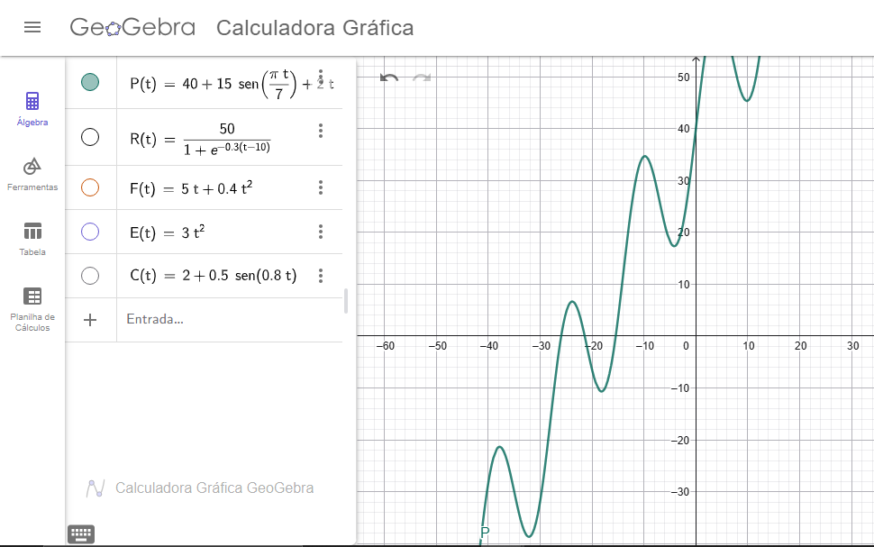
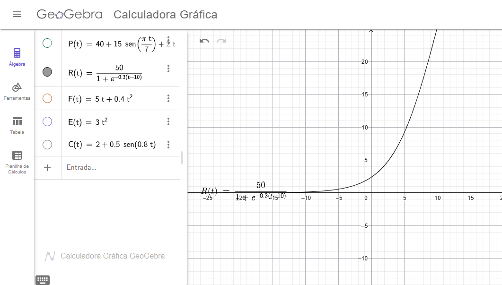
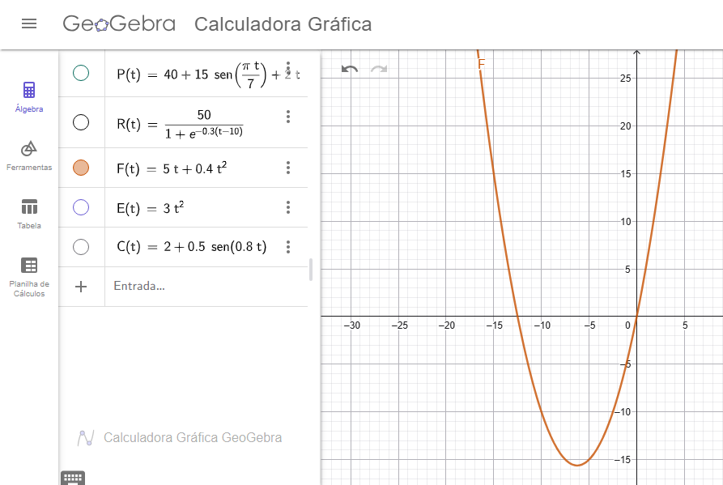
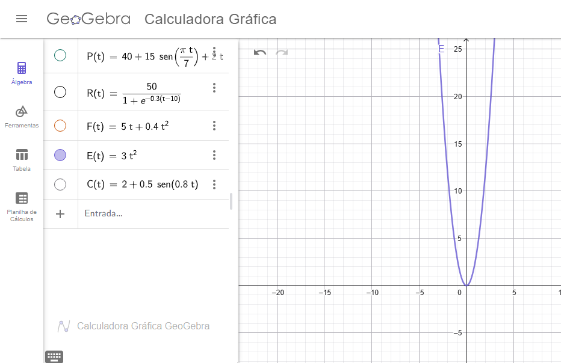
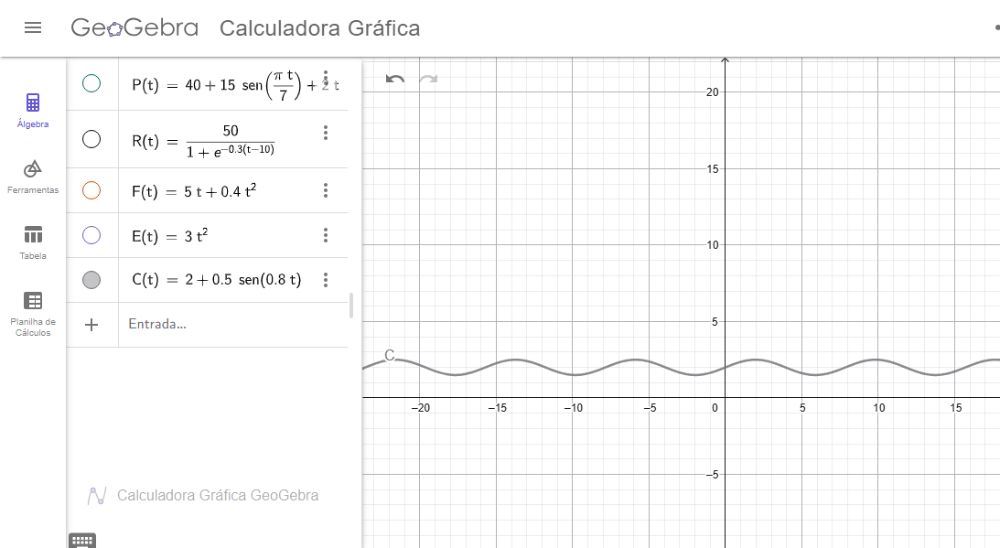
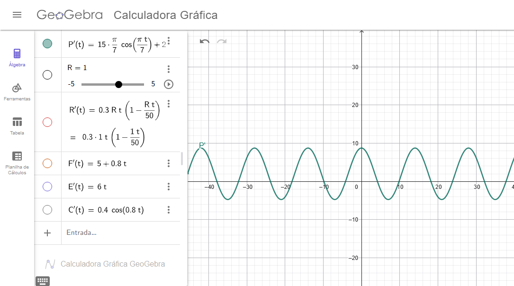
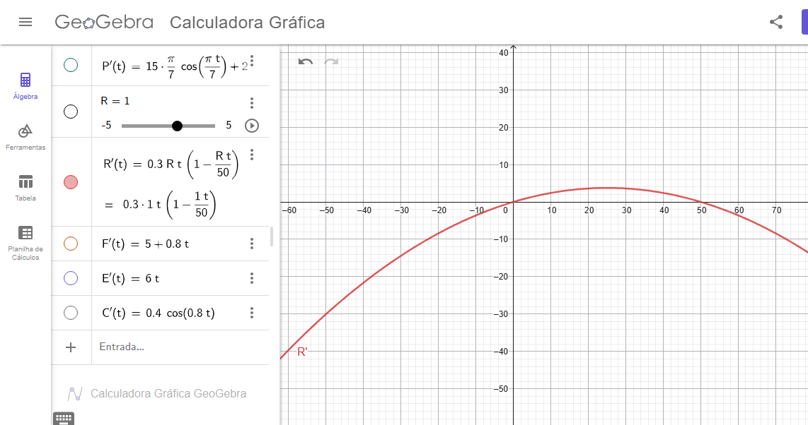
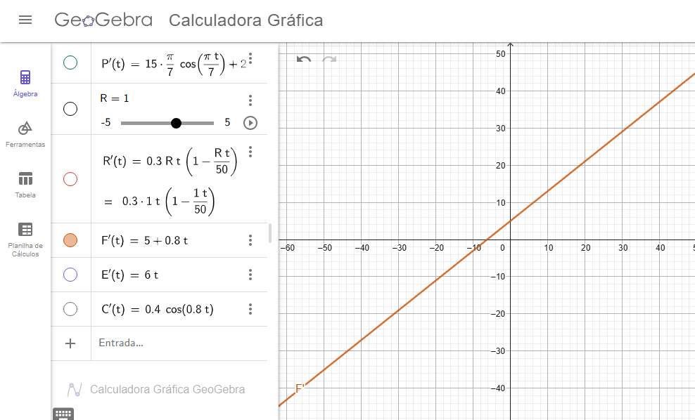
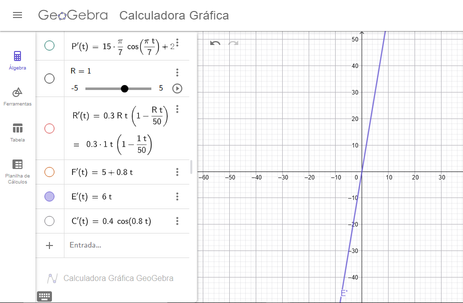
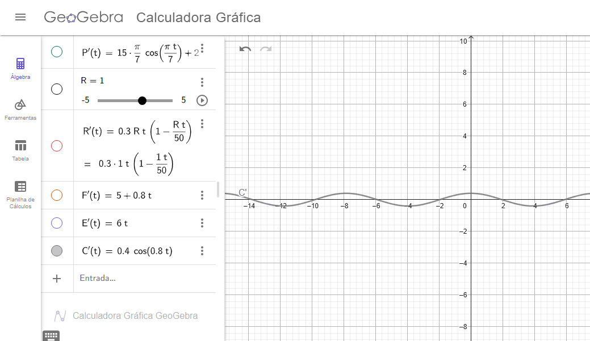

# **Differentiated Problem Solving — MODELAGEM DOS ESTADOS DE PEDIDOS DE UMA GRÁFICA**

## **1. Introdução**

Este relatório apresenta um modelo matemático contínuo para representar a dinâmica dos pedidos de uma gráfica ao longo do tempo.
Os pedidos transitam por diferentes estados operacionais, tais como:

* **Pendentes (P)**
* **Em Produção (R)**
* **Finalizados (F)**
* **Entregues (E)**
* **Cancelados (C)**

Cada estado é descrito por uma **função do tempo**, com derivadas, integrais e limites calculados para analisar:

* taxas de entrada e saída,
* acúmulos,
* crescimento, estabilização ou oscilação,
* equilíbrio ou saturação do sistema.

As funções foram projetadas para serem **realistas**, com comportamentos compatíveis com ambientes de produção gráfica.
Todas estão prontas para uso em **Desmos** ou qualquer software de visualização.

---

# **2. Modelagem Matemática das Funções de Estado**

## **2.1. Pedidos Pendentes – (P(t))**

P(t) = 40 + 15 * sen((π * t) / 7) + 2 * t

**Justificativa:**

* O termo senoidal modela a oscilação semanal de entrada de pedidos.
* O crescimento linear (2t) representa aumento lento da demanda.
* A constante 40 corresponde ao nível médio de pendências.

**Gráfico:**

---

## **2.2. Pedidos em Produção – (R(t))**

R(t) = 50 / (1 + e^(-0.3 * (t - 10)))

**Justificativa:**

* Modelo **logístico**, comum em sistemas que possuem capacidade máxima.
* A produção cresce, mas se estabiliza perto de 50 pedidos (máximo operacional).
* O ponto de inflexão em (t=10) representa estabilização gradual.

**Gráfico:**

---

## **2.3. Pedidos Finalizados – (F(t))**

F(t) = 5 * t + 0.4 * t²

**Justificativa:**

* Função quadrática leve, que representa aumento de produtividade ao longo do tempo.
* Combina efeito linear (produção constante) com aceleração moderada.

**Gráfico:**

---

## **2.4. Pedidos Entregues – (E(t))**

E(t) = 3 * t²

**Justificativa:**

* Modelo quadrático puro, refletindo que entrega depende da quantidade finalizada, que cresce com o tempo.

**Gráfico:**

---

## **2.5. Pedidos Cancelados – (C(t))**

C(t) = 2 + 0.5 * sen(0.8 * t)

**Justificativa:**

* Cancelamentos são oscilatórios, sem tendência de longo prazo.
* A amplitude pequena reflete baixa incidência de cancelamentos.

**Gráfico:**

---

# **3. Derivadas — Taxas de Variação**

As derivadas representam **fluxos operacionais**: chegada, processamento, finalização e entrega.

---

## **3.1. Derivada de Pendentes**

P'(t) = (15 * (π/7)) * cos((π * t) / 7) + 2

**Interpretação:** Taxa de chegada líquida de pedidos.

**Gráfico:**

---

## **3.2. Derivada de Produção**

R'(t) = 0.3 * R(t) * (1 - (R(t) / 50))

**Interpretação:** Velocidade de entrada e saída da produção, máxima próximo do ponto de inflexão.

**Gráfico:**

---

## **3.3. Derivada de Finalizados**

F'(t) = 5 + 0.8 * t

**Interpretação:** Taxa de finalização de pedidos por unidade de tempo.

**Gráfico:**

---

## **3.4. Derivada de Entregues**

E'(t) = 6 * t

**Interpretação:** Velocidade de entregas; cresce proporcionalmente ao tempo.

**Gráfico:**

---

## **3.5. Derivada de Cancelados**

C'(t) = 0.4 * cos(0.8 * t)

**Interpretação:** Oscilação da taxa de cancelamentos.

**Gráfico:**

---

# **4. Integrais — Acúmulo ao Longo do Tempo**

As integrais representam o **volume total acumulado** no estado entre 0 e (t).

---

## **4.1. Integral de Pendentes**

∫P(t) dt = 40*t - (15 * 7 / π) * cos((π * t) / 7) + t² + K

---

## **4.2. Integral de Produção**

∫R(t) dt = (50 / 0.3) * ln(1 + e^(0.3 * (t - 10))) + K

---

## **4.3. Integral de Finalizados**

∫F(t) dt = (5/1) * t²/2 + (0.4/3) * t³ + K

---

## **4.4. Integral de Entregues**

∫E(t) dt = t³ + K

---

## **4.5. Integral de Cancelados**

∫C(t) dt = 2*t - 0.625 * cos(0.8 * t) + K

---

# **5. Limites — Comportamento Assintótico**

Aqui analisamos o comportamento das funções quando (t -> infinito) e (t -> -infinito).

---

## **5.1. Pendentes**

lim(t->22.5) P(t) = 100

---

## **5.2. Produção**

lim(t->∞) R(t) = 50

---

## **5.3. Finalizados**

lim(t->16.97) F(t) = 200

---

## **5.4. Entregues**

E(t) = 3*t^2

Obs.: Sem limite natural (cresce infinito)

---

## **5.5. Cancelados**

lim(t->sen = 1) C(t) = 2.5

Obs.: Função oscilatória — não converge.

---

# **Justificativa detalhada das funções**

Para cada estado (pendente, produção, finalizado, entregue, cancelado), a pergunta é:

> “Que tipo de comportamento esta variável normalmente apresenta ao longo do tempo?”

E então escolhemos **o tipo de função** que melhor representa esse comportamento:

* Linear
* Quadrática
* Logística
* Senoidal
* Constante + oscilação
* Crescimento desacelerado
* Acúmulo puro
* etc.

Cada tipo de função aparece naturalmente em fenômenos reais.

---

# 🟦 **Pendentes — (P(t))**

P(t) = 40 + 15 * sen((π * t) / 7) + 2 * t

## ✔ Por que esses termos?

### **(a) 40 — Nível inicial (constante)**

Toda empresa começa o dia/com ciclo com uma certa quantidade média de pedidos pendentes.
Isso é realista e estabelece um “piso”.

### **(b) 15·sen(...) — Sazonalidade**

Empresas de impressão têm ciclos semanais muito fortes:

* Segunda → pico
* Quarta/Quinta → estabiliza
* Sexta → cai
* Fim de semana → mínimo

A função seno é **a forma matemática clássica** para modelar ciclos:

sen((π * t) / 7)

Esse termo cria uma onda **com período de 14 unidades**, ajustável conforme o tempo medido em dias.

### **(c) + 2t — Tendência crescente**

Empresas que crescem têm **um aumento líquido de pendências** (entrada maior que saída).

Modelo mais simples e realista: um termo linear.

---

# 🟧 **Em Produção — (R(t))**

R(t) = 50 / (1 + e^(-0.3 * (t - 10)))

## ✔ Por que uma função logística?

Porque processos produtivos **não crescem para sempre**.

Toda área de produção apresenta:

1. **crescimento inicial lento**,
2. **aceleração**,
3. **saturação (capacidade máxima)**.

Esse é o comportamento **exato** das curvas logísticas.

### Por que 50?

É o limite da capacidade operacional que definimos:
*por exemplo, 50 pedidos simultâneos em produção.*

### Por que o expoente −0.3(t−10)?

* **0.3** controla a velocidade da curva
* **10** desloca o ponto de inflexão (momento onde produção estabiliza)

Essa função foi escolhida porque:

✔ é suave
✔ tem limite superior
✔ é realista para gargalos de produção
✔ é o modelo mais usado em engenharia e sistemas (inclusive machine learning)

---

# 🟩 **Finalizados — (F(t))**

F(t) = 5 * t + 0.4 * t²

## ✔ Por que essa forma?

Processos de finalização têm 2 características reais:

### **(a) Produção mínima constante: 5t**

Mesmo sem otimização, finalizamos algo todo dia.

### **(b) Aceleração natural: 0.4t²**

Com o tempo:

* operadores ganham ritmo,
* ajustes são feitos,
* filas se organizam,
* máquinas operam de forma mais eficiente.

Produzir mais diariamente ao longo do tempo é comum, e isso é “aceleração”.
Função quadrática é o modelo mais simples e real para isso.

---

# 🟦 **Entregues — (E(t))**

E(t) = 3 * t²

## ✔ Por que quadrática?

Entregas **dependem do número de pedidos finalizados**, que já é crescente (e também quadrático).
Como entrega é uma etapa acoplada, sua curva naturalmente tende a crescer acelerada.

Escolhemos **3t²** por ser:

* simples,
* suave,
* realista,
* e proporcional ao fluxo de finalização.

---

# 🟥 **Cancelados — (C(t))**

C(t) = 2 + 0.5 * sen(0.8 * t)

## ✔ Por que uma função senoidal pequena?

Cancelamentos:

* acontecem ocasionalmente,
* oscilam muito pouco,
* não têm tendência crescente ou decrescente,
* não explodem nem zeram.

Por isso a forma ideal é:

* **constante** (nível médio ≈ 2)
* **+ oscilação pequena** (0.5 seno)

O seno produz variações suaves, aleatórias e cíclicas, como cancelamentos reais.

---

# 🎯 RESUMO DA ESCOLHA DAS FUNÇÕES

| Estado      | Comportamento real      | Tipo de função escolhida | Razão                            |
| ----------- | ----------------------- | ------------------------ | -------------------------------- |
| Pendentes   | Oscilação + crescimento | Seno + Linear            | Sazonalidade + aumento constante |
| Produção    | Crescimento limitado    | Logística                | Capacidade máxima operacional    |
| Finalizados | Produção crescente      | Linear + Quadrático      | Aceleração do fluxo              |
| Entregues   | Crescimento acoplado    | Quadrático               | Depende do ritmo de finalização  |
| Cancelados  | Oscilação baixa         | Senoidal pequena         | Flutuações aleatórias            |

# 🧾 **6. Conclusão**

As funções apresentadas formam um modelo matemático completo, realista e funcional para representar o fluxo de pedidos de uma gráfica.
Elas permitem:

* visualizar comportamento ao longo do tempo,
* identificar gargalos,
* prever saturação,
* avaliar estabilidade ou crescimento,
* entender taxas operacionais,
* e calcular volumes acumulados.

# 👥 Integrantes

* Gabriel Alexandre Fukushima Sakura
* Lucas Henrique Viana Estevam Sena